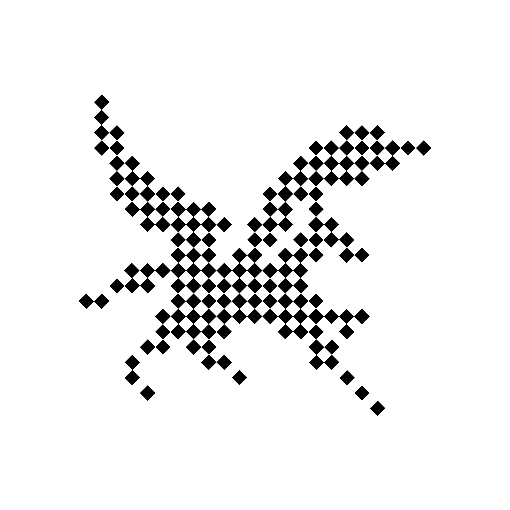

<div align="center">



# Zeraix

### Local AI, engineered from workspace to runtime.

Zeraix is an open-source desktop workspace for running private local models, tools, files, and AI agents on your own computer.

Alongside the application, we continuously research how modern AI models can run more efficiently on personal hardware. **ExactFlux** is the runtime technology developed through this work, with a focus on real memory use, sustained generation speed, hardware adaptation, and verified output correctness.

[Download](#-quick-start)
· [Model Systems Research](#-model-systems-research)
· [Current Research](#current-research-tracks)
· [Developer Guide](#-developer-quick-start)

[](https://discord.gg/PcQ3jr3MfH)
[](https://x.com/ZeraixAI)
[](LICENSE)
[](#-quick-start)

**English** 

</div>

---

<div align="center">


<br />


</div>

## What Zeraix is

Zeraix is built around two connected efforts:

### Zeraix Desktop

The open-source application people can use today:

- run supported local models without a Zeraix account or subscription;
- work with conversations, files, terminal tools, Skills, and sub-agents;
- install and manage GGUF models and compatible runtimes;
- use hardware-aware model and quantization recommendations;
- execute Agent commands through an optional QEMU-based sandbox;
- connect custom OpenAI-compatible endpoints or optional hosted models.

### Zeraix Model Systems

Our ongoing research into how modern models run on consumer hardware:

- model-specific inference optimization;
- memory, storage, and accelerator coordination;
- sustained decoding and tail-latency improvement;
- speculative decoding and multi-token prediction;
- architecture adaptation across MoE, dense, multimodal, long-context, and future model families;
- correctness validation across long requests and multi-turn sessions.

The public desktop release currently uses **llama.cpp** as its general-purpose compatibility runtime. ExactFlux is still under active research and is not yet included in the public source tree because its architecture, interfaces, and validation requirements are still changing rapidly. **We intend to open-source ExactFlux after the research reaches a stable and sufficiently validated stage.** Until then, we will publish progress and reproducible evidence progressively without presenting research prototypes as shipping features.

> We do not claim to train or own the underlying foundation models. Our work focuses on how supported models are prepared, configured, validated, and executed on-device.

## 🚀 Quick Start

Get Zeraix running with a local AI model in a few steps.

No Zeraix account, subscription, or API key is required for the local core.

### 1. Download Zeraix

| Platform | Requirements | Direct download |
|---|---|---|
| 🍎 macOS | macOS 13+ · Apple Silicon | [⬇️ **Download for macOS**](https://github.com/zeraix/zeraix/releases/latest/download/Mac.Zeraix.dmg) |
| 🪟 Windows | Windows 10/11 · x64 | [⬇️ **Download for Windows**](https://github.com/zeraix/zeraix/releases/latest/download/Win.Zeraix.exe) |

You can also view the [latest release notes](https://github.com/zeraix/zeraix/releases/latest).

For local models:

- **16 GB or more system memory is recommended**;
- some smaller models can run with 8 GB;
- larger models and longer contexts require more memory;
- model downloads can require several gigabytes of disk space.

### 2. Install and open Zeraix

#### macOS

1. Open the downloaded `.dmg` file.
2. Drag Zeraix into the Applications folder.
3. Open Zeraix from Applications.

If macOS displays a security warning, verify that the installer was downloaded from the official `zeraix/zeraix` GitHub repository.

#### Windows

1. Open the downloaded `.exe` installer.
2. Choose an installation directory.
3. Complete the installation.
4. Launch Zeraix.

If Windows displays a SmartScreen warning, verify that the installer was downloaded from the official `zeraix/zeraix` GitHub repository before continuing.

### 3. Install a local model

1. Open **Model Library** in Zeraix.
2. Wait for Zeraix to inspect your memory and GPU.
3. Select the model marked **Recommended**.
4. Review its estimated memory and storage requirements.
5. Click **Download & Start**.

Zeraix automatically selects and downloads an appropriate `llama.cpp` runtime for your hardware.

The initial setup may include:

- a `llama.cpp` runtime;
- a GGUF model;
- optional vision or speculative-decoding model files;
- QEMU sandbox resources when the execution sandbox is enabled.

The model is ready when its status changes to **Running**.

### 4. Start your first conversation

1. Return to the Assistant.
2. Select the running local model.
3. Enter a message such as:

> Explain what you can do while keeping model inference on this device.

When a local model is selected, model inference runs on your computer.

### 5. Optional: use Developer Mode

Developer Mode allows Zeraix to work with a directory selected by you.

It can:

- read and search project files;
- create and edit files;
- show changes as diffs;
- execute terminal commands;
- inspect command output;
- use browser tools;
- delegate work to specialized sub-agents.

Before using Developer Mode:

- keep important projects under version control;
- review file diffs before applying changes;
- review commands before approving them;
- verify whether commands are running in the QEMU sandbox or directly on your computer.

Need help? [Report a bug](https://github.com/zeraix/zeraix/issues/new) or join the [Zeraix Discord](https://discord.gg/PcQ3jr3MfH).

## 🔬 Model systems research

Models keep evolving. Zeraix continuously profiles, adapts, and optimizes how they use memory, storage, compute, and decoding resources on personal devices.

Our work is not limited to a single architecture or model family.

> **Current research platform scope (July 2026):** ExactFlux model-systems research currently focuses on **Apple Silicon and macOS**. Zeraix Desktop is available on Windows and can use compatible general-purpose runtimes, but the ExactFlux optimization work described in this section has **not yet been researched or validated on Windows**. Windows model-systems research is planned and will begin as soon as the current Apple Silicon research baseline is sufficiently stable.

### Research areas

| Area | What we study and optimize |
|---|---|
| Memory systems | Real physical memory, unified memory, model working sets, KV cache, and storage-backed execution |
| Runtime execution | Model-specific scheduling, data movement, accelerator utilization, and stable long-running inference |
| Decoding | Sustained token generation, speculative decoding, MTP, and tail-latency behavior |
| Architecture adaptation | MoE, dense, multimodal, long-context, and emerging model architectures |
| Hardware adaptation | Metal, CUDA, Vulkan, CPU, and different system-memory or VRAM tiers |
| Model preparation | Quantization selection, runtime packaging, model assets, and validated device profiles |
| Correctness | Same-algorithm comparisons, deterministic checks, long requests, and multi-turn stability |

### Current research tracks

_Last updated: July 2026_

| Model track | Research focus | Current status | Public availability |
|---|---|---|---|
| Qwen3.6-35B-A3B | Low-memory MoE execution, MTP integration, sustained decoding, and output consistency | **Active research** — internal prototyping and validation in progress | Not publicly available yet |
| Gemma 4 family | Working-set reduction, sustained generation, and tail-latency control | **Active research** — internal prototyping and validation in progress | Not publicly available yet |
| Community GGUF ecosystem | Hardware detection, quantization selection, runtime configuration, and model lifecycle management | **Shipping** | Available in Zeraix Desktop |

Research status definitions:

| Status | Meaning |
|---|---|
| Exploring | Structural analysis and feasibility experiments are in progress |
| Prototype | The approach runs, but has not passed the complete validation gate |
| Validated | The current configuration has passed defined performance and correctness checks |
| Preview | A build is available to selected testers with documented limitations |
| Stable | The capability is included in a supported public release |

### What we measure

Optimization is not judged by a single peak-speed number. Depending on the research track, we evaluate:

- real physical memory rather than model-file size alone;
- prompt processing and sustained token generation separately;
- first-token latency;
- P95/P99 token latency and maximum stalls;
- long-output and multi-turn stability;
- context growth and KV-cache behavior;
- storage traffic and page-fault behavior when relevant;
- same-algorithm output consistency and deterministic hashes;
- behavior across different hardware and memory tiers.

We do not publish per-model performance claims in this README while a research track is still unstable. Once a model track has completed its research and validation gates, it will receive a dedicated model report containing the exact model, quantization, hardware, runtime version, command line, test length, measurement method, results, and known limitations. Until such a report is published, research status should not be interpreted as a reproducible public benchmark or a shipping guarantee.

## Why Zeraix?

Most AI workspaces are designed around cloud APIs, with local models added as a secondary option. Zeraix is built the other way around.

Local models are at the center of the product. Conversations, memory, files, tools, Skills, and Agent workflows are designed to run on your own computer. Cloud models remain available when you choose to use them, but they are not required for the local experience.

Zeraix also treats local inference as an active systems problem. The desktop application provides a usable product today, while our model-systems research explores how larger and more capable models can run on the hardware people already own.

### Local means local

- **Free local core** — use local models and local Agent features without an account, subscription, or usage quota.
- **Private by default** — prompts, conversations, and files used with local models stay on your device.
- **Works offline after setup** — after the required runtimes and models are downloaded, local features can run without Zeraix cloud services.
- **Bring your own model** — run supported GGUF models locally or connect an OpenAI-compatible endpoint.
- **Cloud is optional** — hosted models, accounts, and cloud file services are separate optional features.

### More than a chat client

Zeraix combines the tools needed for local AI work in one desktop application:

- local model installation and management;
- hardware-aware model recommendations;
- Assistant and Developer modes;
- file reading and editing with diff previews;
- integrated terminal and command execution;
- QEMU-based execution sandbox;
- browser tools and automation;
- persistent conversations and local memory;
- Skills and specialized sub-agents;
- optional cloud models and custom API endpoints.

## ✨ Features

### 📦 Local model management

Zeraix manages the local inference workflow from installation to execution:

- browse and download supported GGUF models;
- install and manage a local `llama.cpp` runtime;
- detect system memory, GPU capabilities, and available acceleration;
- recommend models and quantizations based on your hardware;
- support Metal, CUDA, Vulkan, and CPU-oriented runtimes where available;
- choose a separate model storage directory;
- start, stop, update, and inspect the local inference service;
- expose the running model through an OpenAI-compatible local endpoint.

Zeraix distinguishes between three model paths:

- **Community GGUF models** — compatible models and quantizations from the broader open-model ecosystem.
- **Zeraix-tested profiles** — model, quantization, context, and runtime configurations tested by the Zeraix team for specific hardware tiers. These profiles do not imply that Zeraix trained or owns the underlying model.
- **ExactFlux research builds** — model-specific inference builds under active internal research. They are not part of the public release unless a future release explicitly states otherwise.

Model availability, licensing, performance, and hardware requirements vary. Review the license of each model before using or redistributing it.

### 💬 Assistant Mode

Assistant Mode is designed for everyday local AI work:

- continue conversations across supported models;
- analyze text documents and images with compatible models;
- keep local conversations and memory on your device;
- add reusable Skills for specialized tasks;
- connect compatible MCP servers;
- switch between local models, custom endpoints, and optional hosted models.

### 🛠️ Developer Mode

Developer Mode gives the selected model controlled access to a workspace:

- read and search project files;
- create and edit files;
- preview changes as diffs;
- execute terminal commands;
- inspect command output and iterate;
- use browser tools for documentation and application testing;
- delegate exploration, planning, and review to specialized sub-agents;
- compact long contexts while preserving the original conversation history.

File and command tools are scoped to the working directory selected by the user. Sensitive operations may require explicit approval.

### 🛡️ Local execution sandbox

Zeraix includes an optional QEMU-based Linux environment for Agent commands:

- hardware-accelerated virtualization where supported;
- one persistent virtual machine per session instead of one boot per command;
- workspace sharing between the host and guest;
- per-command filesystem scoping using `bubblewrap`;
- captured command output and execution timeouts;
- port forwarding for local development servers;
- execution paths for macOS, Windows, and Linux environments.

If sandbox resources or hardware virtualization are unavailable, some operations may use native host execution depending on the selected mode and current implementation.

Always verify the execution indicator before approving commands that affect important files.

### 🧠 Memory and context

- store conversations locally by project;
- keep separate Assistant and Developer workspaces;
- switch models without discarding conversation history;
- save reusable memory as local Markdown files;
- compact long model contexts without rewriting the original conversation;
- encrypt supported local conversation data when application encryption is available.

### 🧩 Skills and sub-agents

- built-in Skills for coding, research, review, writing, and data extraction;
- project-level Skill discovery;
- user control over project instructions;
- specialized exploration, planning, and review sub-agents;
- restricted tool sets for read-only and review-oriented agents.

### ☁️ Cloud when you choose it

Cloud capabilities are optional and separate from the local core:

- official hosted model access;
- OpenAI-compatible custom endpoints;
- account-based services;
- optional cloud file and platform features.

When you select a hosted model or custom endpoint, prompts and supported attachments are sent to the provider associated with that model. Third-party providers may charge separately and apply their own privacy and retention policies.

### 🌍 Multilingual interface

The interface includes translations for:

- English;
- 简体中文;
- 繁體中文;
- 日本語;
- 한국어;
- Français;
- Español;
- Italiano;
- Deutsch;
- Português;
- and additional variants represented in the repository.

## Public, upstream, and research boundaries

| Capability | Available | Account required | Offline after setup | Implementation status |
|---|:---:|:---:|:---:|---|
| Zeraix Desktop local core | ✅ | No | ✅ | Open source in this repository |
| Local conversations and memory | ✅ | No | ✅ | Open source in this repository |
| File and terminal Agent tools | ✅ | No | ✅ | Open source in this repository |
| QEMU execution sandbox | ✅ | No | ✅ | Open source in this repository |
| Skills and sub-agents | ✅ | No | ✅ | Open source in this repository |
| Custom OpenAI-compatible endpoints | ✅ | No | Depends on endpoint | Open source in this repository |
| General local inference | ✅ | No | ✅ | Uses separately licensed upstream runtimes such as llama.cpp |
| Zeraix-tested model profiles | ✅ | No | ✅ | Configuration and validation layer in this repository |
| ExactFlux research runtime | Research | No | Intended | Currently focused on Apple Silicon/macOS; planned for open source after stabilization and validation |
| Zeraix hosted models | Optional | Yes | No | Proprietary service; client integration only |
| Zeraix account and cloud files | Optional | Yes | No | Proprietary service; client integration only |

Zeraix does not charge for connecting a custom endpoint. The endpoint provider may charge for its service.

## 🔒 Privacy and network behavior

### Local model usage

When a local model is selected:

- inference runs on your computer;
- prompts do not need to be sent to a Zeraix model service;
- local conversations and workspace operations remain on your device.

### Initial downloads

Some local features require network access during setup:

- `llama.cpp` runtime packages;
- GGUF model files;
- QEMU binaries;
- the Linux sandbox image, kernel, and initial RAM filesystem.

After the required resources are installed, the local core is designed to operate without Zeraix cloud services.

### Cloud and custom endpoints

When a hosted model or custom endpoint is selected, prompts and supported attachments are sent to that provider.

Review the provider’s terms, pricing, privacy policy, and retention policy before sending sensitive information.

### Agent permissions

AI-generated commands and file modifications can be incorrect or unsafe.

Always:

- review permission requests;
- inspect proposed diffs;
- verify file paths;
- review commands before approving them;
- keep backups or version control enabled.

For vulnerability reporting, see [Security.md](Security.md). For additional privacy information, see [Privacy.md](Privacy.md).

## 🧑‍💻 Developer Quick Start

### Requirements

- Node.js 20.9 or newer;
- Corepack;
- Git;
- macOS, Windows, or Linux for local development.

### Run the full desktop application

```bash
git clone https://github.com/zeraix/zeraix.git
cd zeraix
corepack enable
pnpm install --frozen-lockfile
pnpm electron:dev
```

This starts:

- the Next.js renderer at `http://localhost:3000`;
- the Electron desktop process;
- Electron IPC integrations;
- local model, file, terminal, browser, and sandbox features.

Use the Electron window for the complete Zeraix experience.

Cloud credentials are not required to run the local core. Some optional authentication and hosted services require additional configuration.

### Run only the web renderer

```bash
pnpm dev
```

The web renderer is useful for interface development, but it does not provide the complete desktop runtime.

The following features require Electron:

- local model management;
- Electron IPC;
- local file access;
- terminal execution;
- native notifications;
- browser automation;
- QEMU sandbox integration.

### Optional environment configuration

Copy the example environment file only when you need to override the defaults:

```bash
cp .env.example .env.local
```

Never commit real API keys, OAuth credentials, access tokens, private keys, or `.env` files.

### Validate your changes

```bash
pnpm typecheck
pnpm lint
pnpm build
```

### Build desktop packages

```bash
# macOS
pnpm dist:mac

# Windows
pnpm dist:win
```

Desktop packaging downloads platform resources and may require platform-specific signing and notarization credentials. Unsigned local builds can trigger operating-system security warnings.

For additional implementation details, see:

- [`sandbox/qemu/README.md`](sandbox/qemu/README.md)
- [`resources/bin/README.md`](resources/bin/README.md)
- [`resources/README.md`](resources/README.md)

## Architecture

```text
Zeraix
├── Zeraix Desktop
│   ├── Next.js / React renderer
│   │   ├── Assistant and Developer interfaces
│   │   ├── Conversation state and context compaction
│   │   ├── Skills and sub-agents
│   │   └── Permission and diff views
│   ├── Electron main process
│   │   ├── Secure preload and IPC bridges
│   │   ├── Local conversation storage
│   │   ├── LLM request proxy
│   │   ├── Local model and runtime management
│   │   ├── File and terminal tools
│   │   └── Browser automation
│   ├── Execution layer
│   │   ├── QEMU Linux sandbox
│   │   └── Native execution path
│   └── Model layer
│       ├── Community GGUF models
│       ├── Zeraix-tested profiles
│       ├── Custom OpenAI-compatible endpoints
│       └── Optional Zeraix cloud services
└── Zeraix Model Systems
    ├── Architecture and workload profiling
    ├── Memory and runtime research
    ├── Decoding and hardware adaptation
    ├── Correctness and regression validation
    └── ExactFlux research runtime
```

Important source directories:

| Path | Purpose |
|---|---|
| `src/app/agent/` | Assistant and Developer application pages |
| `src/app/agent/chat/` | Agent conversation UI and runtime loop |
| `src/lib/ai/` | Models, memory, Skills, sub-agents, and AI utilities |
| `src/components/ai/` | Model library and AI interface components |
| `electron/` | Electron main process and renderer bridges |
| `electron/llm/` | Local model runtime management and request proxy |
| `electron/tools/` | Agent tools, terminal integration, and sandbox routing |
| `electron/tools/sandbox/` | QEMU control, filesystem sharing, and execution engine |
| `sandbox/qemu/` | Sandbox image build files and documentation |
| `scripts/` | Build, packaging, and resource publication scripts |

The ExactFlux research runtime is not currently part of the public source directories listed above. We intend to open-source it after the architecture and validation baseline are stable enough for external use and contribution.

## Known limitations

- macOS release builds currently target Apple Silicon.
- Windows release builds currently target x64.
- ExactFlux model-systems research currently focuses on Apple Silicon/macOS and has not yet been validated on Windows. Windows users should not assume that current research claims apply to their hardware.
- Local model quality and tool-calling reliability depend on the selected model.
- Performance depends on memory, GPU support, model size, quantization, context length, and runtime configuration.
- Initial model and sandbox downloads can be large.
- The QEMU sandbox requires hardware virtualization and additional resources.
- Some Agent operations may use native execution when the sandbox is unavailable or disabled.
- Hosted services require network access and may require an account or separate payment.
- ExactFlux research results are not shipping features unless a release explicitly states otherwise.

## Troubleshooting

### No local models are recommended

Zeraix currently requires approximately 8 GB of usable memory for the smallest supported local model.

Close memory-intensive applications and run hardware detection again.

### A model download is slow

GGUF model files can be several gigabytes. Download speed depends on your network connection and the model host.

Keep Zeraix open until the download finishes.

### A model does not start

Try the following:

1. stop the model;
2. restart Zeraix;
3. open Model Library;
4. recheck the local runtime;
5. reduce context length;
6. disable vision;
7. select a smaller model;
8. inspect the runtime log from Model Library.

On Windows, Zeraix may fall back from CUDA to Vulkan and then to CPU when a GPU runtime cannot start.

### Developer Mode cannot execute a command

Check the current execution mode.

If the QEMU sandbox is unavailable, verify that:

- hardware virtualization is enabled;
- sandbox resources have finished downloading;
- sufficient disk space is available;
- security software is not blocking QEMU.

Some modes may offer native execution as a fallback. Review the execution indicator before approving a command.

### The web page does not have desktop features

`pnpm dev` starts only the web renderer. Use:

```bash
pnpm electron:dev
```

to run the full desktop application.

## Roadmap

### Zeraix Desktop

- [x] Local and cloud model workspace
- [x] Assistant Mode with tool calling
- [x] Developer Mode with files and terminal
- [x] Hardware-aware model recommendations
- [x] GGUF model downloads and `llama.cpp` management
- [x] Persistent local conversations and memory
- [x] Cross-model conversation continuity
- [x] Skills and specialized sub-agents
- [x] QEMU-based execution sandbox
- [x] Multimodal attachments for supported models
- [ ] Expand automated tests and continuous integration
- [ ] Improve sandbox visibility and strict execution policies
- [ ] Add intelligent local and cloud model routing

### Zeraix Model Systems

- [x] Establish repeatable low-memory model research baselines
- [x] Add correctness gates for model-specific optimization experiments
- [ ] Complete validation of the initial Qwen3.6 and Gemma 4 research tracks
- [ ] Publish reproducible benchmark methodology and hardware reports
- [ ] Expand validation across Apple Silicon memory tiers
- [ ] Begin Windows model-systems profiling and establish the first Windows research baseline
- [ ] Generalize model-specific research code into reusable architecture adapters
- [ ] Prepare the first ExactFlux research preview
- [ ] Extend research to additional architectures and hardware backends
- [ ] Publish recurring model-systems research updates

Roadmap items are directional and may change as model architectures, upstream runtimes, hardware, and validation results evolve.

## Contributing

Bug reports, documentation improvements, feature proposals, translations, model compatibility reports, hardware results, and focused code contributions are welcome.

Good ways to contribute include:

- testing models on different hardware;
- reporting model compatibility and performance behavior;
- improving translations and documentation;
- reproducing reported bugs;
- improving error messages;
- adding tests;
- submitting focused bug fixes.

Before submitting a pull request:

1. Read [Contributing.md](Contributing.md).
2. Keep each pull request focused on one concern.
3. Run the available validation commands.
4. Do not include secrets, proprietary code, model files, or incompatible third-party material.

Opening Issues, reporting bugs, suggesting features, sharing hardware results, and participating in Discussions are all welcome.

Look for issues labeled:

- `good first issue`;
- `help wanted`;
- `documentation`;
- `translation`.

## Security

Do not report security vulnerabilities through public Issues, Discussions, or pull requests.

Follow the private reporting process described in [Security.md](Security.md).

## Open-source and commercial services

This repository contains Zeraix Desktop and its local-first application runtime.

The public local core is free to use under the terms of AGPL-3.0. Separately licensed third-party runtimes, models, and downloaded assets remain governed by their respective licenses.

ExactFlux is an active research runtime and is not currently included in this public source tree. We intend to open-source it after the architecture, interfaces, and validation baseline are stable enough for external use and contribution. The exact release scope, timing, and license will be stated clearly before publication; no specific release date is promised while the research remains unstable.

Zeraix also operates optional proprietary services, which may include:

- accounts;
- hosted models;
- cloud files;
- routing;
- commercial platform capabilities.

These services are not required to use the public local core and are not part of this repository.

## License

Zeraix Desktop is licensed under the [GNU Affero General Public License v3.0](LICENSE).

You may use, study, modify, and redistribute the software in this repository under the terms of that license.

AGPL-3.0 obligations may apply when distributing modified versions or providing modified versions for use over a network.

If AGPL-3.0 does not fit your commercial use case, contact **emma@zeraix.com** to discuss commercial licensing.

Third-party models, runtimes, libraries, and downloaded components remain governed by their respective licenses.

## Community

- [Discord](https://discord.gg/PcQ3jr3MfH)
- [X / Twitter](https://x.com/ZeraixAI)
- [Bug reports](https://github.com/zeraix/zeraix/issues/new)
- [Feature requests](https://github.com/zeraix/zeraix/issues/new)
- Commercial and partnership inquiries: **emma@zeraix.com**

---

<div align="center">

**Local AI should belong to the person running it — and the models should keep getting better on the hardware they already own.**

If that idea resonates with you, consider starring the repository, testing Zeraix on your hardware, and helping us improve local AI.

</div>

<div align="center">

**Built for local. If that's your thing too, a ⭐ means a lot.**

</div>
</table>
